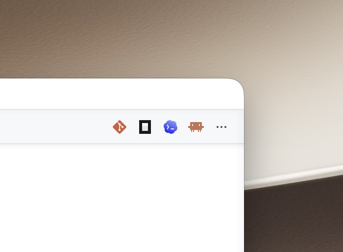

# CLI Dock

CLI Dock is a small VS Code extension that launches CLI tools from editor title buttons.



## Installation

Install CLI Dock from the [Visual Studio Marketplace](https://marketplace.visualstudio.com/items?itemName=oneo.cli-dock).

You can also install it from VS Code:

1. Open the Extensions view.
2. Search for `CLI Dock`.
3. Select the extension published by `oneo` and click **Install**.

Or install it from the command line:

```bash
code --install-extension oneo.cli-dock
```

The launched CLI tools must already be installed and available in your shell `PATH`.

## Usage

Open a file in VS Code and use the editor title buttons to run `lazygit`, `opencode`, `codex`, or `claude` in the current editor group. The same commands are also available from the Command Palette under the `CLI Dock` category.

## Features

- Adds editor title buttons for `lazygit`, `opencode`, `codex`, and `claude`.
- Open an integrated terminal in the current editor group and run the selected command immediately.
- Uses bundled command icons for a compact native toolbar experience.

## Development

```bash
pnpm install
pnpm run build
```

Press F5 in VS Code and choose `Run Extension`.

## Publishing

```bash
pnpm run build
pnpm dlx @vscode/vsce package
pnpm dlx @vscode/vsce publish
```
